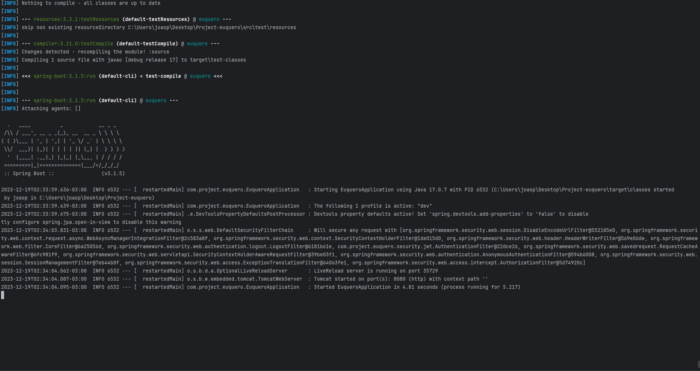

## Sumário

- [Sobre](#about)
- [Começando](#started)
- [Execução](#execution)

## Sobre <a name = "about"></a>

O Projeto DIFM é uma aplicação web que tem como objetivo auxiliar na organização e controle de produtos em um sistema. 
Com essa aplicação, os usuários têm a capacidade de cadastrar, visualizar, atualizar e excluir produtos de um inventário. 

## Começando <a name = "started"></a>

O projeto foi desenvolvido utilizando Java 17, Maven 3.9.1 e Spring Boot 3.1.2. 

### Pré-requisitos

É necessário instalar a JDK 17 e o MySQL ou Docker na máquina local, o mais indicado é a utilização de _containers_ com o [Docker](https://www.docker.com/).

### CONFIGURAÇÃO DAS VARIAVÉIS DE AMBIENTE

A aplicação utiliza algumas variavéis de ambiente que são importantes para o bom funcionando, então, é necessario que crie o arquivo ```dev.env``` na raiz do projeto e cole o texto abaixo, substituindo os valores que estão com **ASTERISCOS**:
```
#API
PORT=8080                                           --> PORTA QUE A API VAI SER ABERTA

# DATABASE        
DATABASE_USERNAME=********                          --> USERNAME DO BANCO
DATABASE_PASSWORD=********                          --> SENHA DO BANCO
DATABASE_SCHEMA=********                            --> NOME DO BANCO
DATABASE_USER=********                              --> USER DO BANCO
DATABASE_PORT=0000                                  --> PORTA PARA ENTRAR NO BANCO
DATABASE_URL=jdbc:mysql://localhost:${DATABASE_PORT}/${DATABASE_SCHEMA}?useTimezone=true&serverTimezone=UTC&useSSL=true  --> URL DO BANCO

# EMAIL
MAIL_USERNAME=********                              --> EMAIL QUE FARÁ OS ENVIOS
MAIL_PASSWORD=********                              --> SENHA DE APP DO EMAIL
```
## Execução <a name = "execution"></a>

Vamos executar a aplicação de 3 formas diferentes, escolha qual achar melhor.

### Docker

Para executarmos no docker, digite o seguinte comando no terminal ```docker-compose --profile dev --env-file dev.env up -d --build```.

Após digitar o comando, um container será criado com a API, Banco de Dados e o pgAdmin, depois que a instalação estiver concluida a aplicação irá abrir automaticamente e já estará pronta para uso.

### Maven

Para executar a aplicação através do Maven, primeiro precisamos abrir o banco de dados.

Caso queira criar o banco utilizando um container no Docker, digite o seguinte comando no terminal ```docker-compose --env-file dev.env up -d```, após a instalação o Banco de Dados e o pgAdmin irão iniciar automaticamente.

Depois que o Banco de Dados estiver online, digite o seguinte comando ```mvn clean install```, após estar concluido digite este outro comando ```mvn spring-boot:run -Pdev```, assim que der enter a aplicação começará a ser compilada e executada.

### Java

Para executar a aplicação através do .jar, primeiro precisamos abrir o banco de dados.

Caso queira criar o banco utilizando um container no Docker, digite o seguinte comando no terminal ```docker-compose --env-file dev.env up -d```, após a instalação o Banco de Dados e o pgAdmin irão iniciar automaticamente.

Depois que o Banco de Dados estiver online, digite o seguinte comando ```mvn clean package```, após estar concluido digite este outro comando ```java -jar target/projetodifm-0.0.1-SNAPSHOT.jar --spring.profiles.active=dev```, assim que der enter a aplicação começará a ser executada. 

Em todas as formas de executar, a aplicação deve mostrar a seguinte saída:


